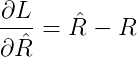
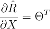
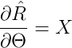
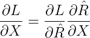
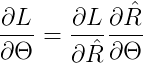

# Popcorn
Wonder what movie to watch next with your friends and family? Use Popcorn to fetch movie recommendations!

## Local Development Setup
### Dependency
The default choice of Go is 1.9.3 for this project and we are using `dep` to perform package dependency management. For
frontend, we are using `npm` for JavaScript dependency management. Thus, you need the following:

* Go 1.9.3
* PostgreSQL 9.3
* Node 6.10
* npm 3.10
* dep latest

### Database
Step one, enter `psql` command line interface:
```
psql postgres
```

Check what the users you have in your local Postgres server:
```
\du
```

Create a user named `popcorn`
```
create user popcorn superuser createdb createrole;
```

Give your `popcorn` a password:
```
alter user popcorn with password 'popcorn';
```

Now you can go ahead and create a database with owner pointing to `popcorn`:
```
create database popcorn_development with owner=popcorn;
```

Quit `psql`:
```
\q
```

## Build Project
### Backend
Inside your popcorn directory, Run `go install` to build the binary for your server
```
go install
```

Run `go install` to build the binaries for other commands
```
go install ./cmd/...
```

To start the server, simply run
```
popcorn
```

To seed the database, simply run
```
seed
```

Check if your seeds are actually working
```
psql popcorn_development
```

Enter the following SQL command:
```
select title from movies;
```

### Frontend
Install all the required node modules
```
npm install
```

And then build your scripts and style sheets
```
npm run build:watch
```

## How Does Popcorn Work?
### Collaborative Filtering
Coming soon...

### Low Rank Matrix Factorization
Suppose that our system has **I** users and **J** movies. We assign **K** latent features to each user and movie in the
system. We can construct a matrix factorization as follows:


**X** represents the latent feature matrix of all users in our system. The greek letter **big theta** represents the
latent feature matrix for all movies in our system. The matrix product of user latent features and transpose of movie
latent features is the model predicted rating matrix.


Let **R** represents the the actual rating we received from the MovieLens dataset. For every missing value in **R**, we
will replace them with the average rating each movie received from the poll of users. Also we have included a regularization
term to prevent model over-fitting. Then we define the loss function as follows:


Thus, figuring out the latent features for movies and users has become a constraint optimization problem.

### Partial Derivatives & Gradients
Let's find the gradient of **L** with respect to the output of our low-rank matrix model. The one-half term will get
cancel out by the square term when we take the derivatives.



Now we proceed to seek the gradient of model output with respect to **X** and **big theta**.





Using chain rule, we can then derive the following results:





In Python
```Python
"""Denote U as the user latent feature matrix and M as the movie latent feature matrix"""
model_pred = np.dot(U, M.T)

grad_pred = model_pred - R
grad_u = np.dot(grad_pred, M) + (reg * U)
grad_m = np.dot(grad_pred.T, U) + (reg * M)
```

### Tuning Hyperparameters
We use 90% of our training data as the pure training set while the other 10% is our validation set. We will use this
validation set to tune our hyper parameters such as how many features to use, what kind of regularization we should
enforce, what is the learning rate and etc...

For example, using 880564 training samples and 97963 test samples from 10000 users on 45844 movies, with `feature
dimension = 10`, `reg = 0`. The RMSE is approximately 0.98206.

This number can be improved when we specifically select users who have rated more than 300 movies.

| no. training | no. test | users | movies | feature dim. | learning rate | regularization | no. iterations | RMSE |
|-------------:|---------:|-------|--------|--------------|---------------|----------------|----------------|------|
| 4325055      | 480749   | 10000 | 45844  | 10           | 1e-5          | 0              | 100            |0.950 |
| 5597934      | 621800   | 10000 | 45844  | 10           | 1e-5          | 0              | 200            |0.936 |

## TODO
[ ] Add year range and review count percentile to filter
[ ] Seed database with the big movie set and see how things perform
[ ] Perform similarity testing to see if the algorithm is working
