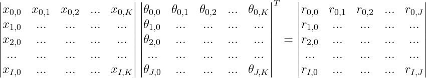
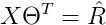
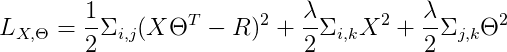

# Popcorn
Wonder what movie to watch next with your friends and family? Use Popcorn to fetch movie recommendations!


## How Does Popcorn Work?
### Collaborative Filtering
To be written by Carmen To...

### Low Rank Matrix Factorization
Suppose that our system has **I** users and **J** movies. We assign **K** latent features to each user and movie in the
system. We can construct a matrix factorization as follows:



**X** represents the latent feature matrix of all users in our system. The greek letter **big theta** represents the
latent feature matrix for all movies in our system. The matrix product of user latent features and transpose of movie
latent features is the model predicted rating matrix.



Let **R** represents the the actual rating we received from the MovieLens dataset. For every missing value in **R**, we
will replace them with the average rating each movie received from the poll of users. Also we have included a regularization
term to prevent model over-fitting. Then we define the loss function as follows:



Thus, figuring out the latent features for movies and users has become a constraint optimization problem.

### Why does it work?
The idea of low rank factorization comes from singular value decomposition in linear algebra. It is difficult to show
mathematics using GitHub markdown. The intuition of SVD technique is explained in this jupyter notebook:

[Singular Value Decomposition](https://github.com/calvinfeng/low-rank-matrix-factorization/blob/master/low_rank_matrix_factorization.ipynb)

How to apply low rank matrix factorization is explained in this notebook:

[Low Rank Matrix Factorization](https://github.com/calvinfeng/low-rank-matrix-factorization/blob/master/low_rank_matrix_factorization.ipynb)

Implementation of above algorithm is written in Go for production server. Although `numpy` is known to be very performant
because it uses C binding, surprisingly `gonum` in Golang is actually 30% faster than numpy when it comes to basic matrix
operations (I can't say for eigenvalue decomposition type of operations.) Also, iterative implemetation of matrix
factorization is much much much more performant when it is written in Go.

### Benchmark
```golang
package main

import (
  "testing"
  "gonum.org/v1/gonum/mat"
  "math/rand"
  "time"
)

func RandMat(row, col int) *mat.Dense {
	rand.Seed(time.Now().UTC().Unix())

	randFloats := []float64{}
	for i := 0; i < row*col; i++ {
		randFloats = append(randFloats, rand.Float64())
	}

	return mat.NewDense(row, col, randFloats)
}

func BenchmarkMatMul(b *testing.B) {
  bigMat := RandMat(2000, 2000)
  result := mat.NewDense(2000, 2000, nil)
  result.Mul(bigMat, bigMat)
}
```
```
goos: linux
goarch: amd64
pkg: matrix-benchmark
BenchmarkMatMul-4   	2000000000	         0.36 ns/op
PASS
ok  	matrix-benchmark	21.133s
```

```python
import cProfile
import numpy as np


def mat_mul():
    big_mat = np.random.rand(2000, 2000)
    result = big_mat.dot(big_mat)


if __name__ == '__main__':
    cProfile.run('mat_mul()')
```
```
5 function calls in 0.513 seconds

Ordered by: standard name

ncalls  tottime  percall  cumtime  percall filename:lineno(function)
1    0.000    0.000    0.513    0.513 <string>:1(<module>)
1    0.000    0.000    0.513    0.513 matrix_test.py:5(mat_mul)
1    0.000    0.000    0.000    0.000 {method 'disable' of '_lsprof.Profiler' objects}
1    0.487    0.487    0.487    0.487 {method 'dot' of 'numpy.ndarray' objects}
1    0.026    0.026    0.026    0.026 {method 'rand' of 'mtrand.RandomState' objects}
```

Notice how insanely fast is `gonum`.

## Local Development Setup
### Dependency
The default choice of Go is 1.9.3 for this project and we are using `dep` to perform package dependency management. For
frontend, we are using `npm` for JavaScript dependency management. Thus, you need the following:

* Go 1.9.3
* PostgreSQL 9.3
* Node 6.10
* npm 3.10
* dep latest

### Database
Step one, enter `psql` command line interface:
```
psql postgres
```

Check what the users you have in your local Postgres server:
```
\du
```

Create a user named `popcorn`
```
create user popcorn superuser createdb createrole;
```

Give your `popcorn` a password:
```
alter user popcorn with password 'popcorn';
```

Now you can go ahead and create a database with owner pointing to `popcorn`:
```
create database popcorn_development with owner=popcorn;
```

Quit `psql`:
```
\q
```

## Build Project
### Backend
Inside your popcorn directory, Run `go install` to build the binary for your server
```
go install
```

Run `go install` to build the binaries for other commands
```
go install ./cmd/...
```

To start the server, simply run
```
popcorn
```

To seed the database, simply run
```
seed
```

Check if your seeds are actually working
```
psql popcorn_development
```

Enter the following SQL command:
```
select title from movies;
```

### Frontend
Install all the required node modules
```
npm install
```

And then build your scripts and style sheets
```
npm run build:watch
```

### Iterative Approach vs Vectorized Approach
The rating matrix is extremely sparse, more than 99% of the whole matrix is filled with zero's. This creates a huge memory
problem as we try to include more users and movies during the training phase. The only solution to the problem is to resort
back to an iterative approach.

### Tuning Hyperparameters
We use 90% of our training data as the pure training set while the other 10% is our validation set. We will use this
validation set to tune our hyper parameters such as how many features to use, what kind of regularization we should
enforce, what is the learning rate and etc...

For example, using 880564 training samples and 97963 test samples from 10000 users on 45844 movies, with `feature
dimension = 10`, `reg = 0`. The RMSE is approximately 0.98206.

This number can be improved when we specifically select users who have rated more than 300 movies.

| Trial | no. training | no. test | users | movies | feature dim. | learning rate | regularization | no. iterations | RMSE |
|-------|-------------:|---------:|-------|--------|--------------|---------------|----------------|----------------|------|
|1      | 4325055      | 480749   | 10000 | 45844  | 10           | 1e-5          | 0              | 100            |0.950 |
|2      | 5597934      | 621800   | 10000 | 45844  | 10           | 1e-5          | 0              | 200            |0.936 |
|3      | 10334778     | 10334778 | 60496 | 44945  | 10           | 1e-5          | 0.03           | 400            |0.869 |
|4      | 3378567      | 375513   | 44248 | 22715  | 10           | 3e-5          | 0.03           | 400            |0.882 |
|5      | 10336416     | 1145704  | 60496 | 44945  | 10           | 3e-5          | 0.03           | 400            |0.856 |

|Trial | Note                                    |
|------|-----------------------------------------|
| 1    | each user has at least rated 300 movies |
| 2    | each user has at least rated 300 movies |
| 3    | each user has at least rated 50 movies, lowering the bar will include more users with cutoff timestamp 1167609600|
| 4    | each user has at least rated 30 movies but less than 200 ratings with cutoff timpestamp 1167609600|
| 5    | each user has at least rated 30 movies with cutoff timestamp 1167609600|

In the later experimentation, we have discovered that actually users with more ratings do not seem to provide better
information about the movies. At first we tried users who each has at least 300 ratings. Then we moved the number to
fewer numbers. Although selecting users with 300+ ratings give us a better RMSE, it does not mean that the feature
vector we learned for each movie is accurate.

Diversity is the key. As I included more users, around 60,000, the results of the training become better. There are two
metrics I use to measure to fitness of a model; (1) the traditional RMSE way and (2) how well movies are clustered together.
For example, if I pick Toy Story, the nearest neighbors should include Toy Story 2 and Toy Story 3 along with other Pixar
animated films.
```
Choosen movie is Toy Story (1995)
Nearest neigbor: Ratatouille (2007) with distance 0.003
Nearest neigbor: Incredibles, The (2004) with distance 0.003
Nearest neigbor: Monsters, Inc. (2001) with distance 0.005
Nearest neigbor: Blood Diamond (2006) with distance 0.009
Nearest neigbor: Rocky (1976) with distance 0.009
Nearest neigbor: Finding Nemo (2003) with distance 0.011
Nearest neigbor: Billy Elliot (2000) with distance 0.011
Nearest neigbor: Slumdog Millionaire (2008) with distance 0.012
Nearest neigbor: Superbad (2007) with distance 0.012
Nearest neigbor: Fugitive, The (1993) with distance 0.012
Nearest neigbor: Truman Show, The (1998) with distance 0.012
Nearest neigbor: Ghostbusters (a.k.a. Ghost Busters) (1984) with distance 0.013
Nearest neigbor: Indiana Jones and the Temple of Doom (1984) with distance 0.013
Nearest neigbor: Illusionist, The (2006) with distance 0.013
Nearest neigbor: Terminator, The (1984) with distance 0.013
Nearest neigbor: Iron Man (2008) with distance 0.013
Nearest neigbor: Toy Story 2 (1999) with distance 0.014
Nearest neigbor: Interview with the Vampire: The Vampire Chronicles (1994) with distance 0.014
Nearest neigbor: Fish Called Wanda, A (1988) with distance 0.014
Nearest neigbor: Braveheart (1995) with distance 0.015
Nearest neigbor: Lion King, The (1994) with distance 0.015
Nearest neigbor: Nightmare Before Christmas, The (1993) with distance 0.015
Nearest neigbor: Gone Baby Gone (2007) with distance 0.015
Nearest neigbor: Toy Story 3 (2010) with distance 0.016
Nearest neigbor: Airplane! (1980) with distance 0.016
...
```
